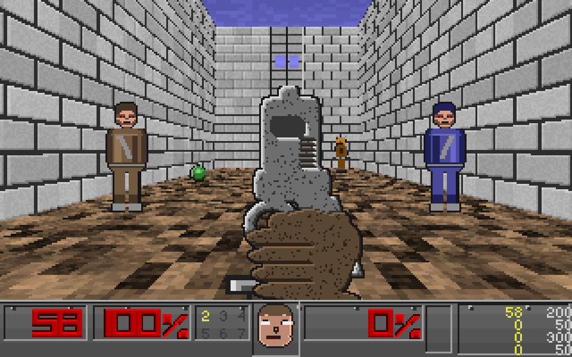
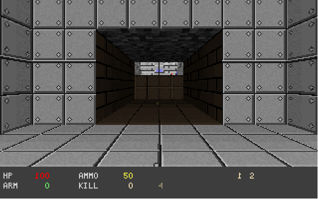
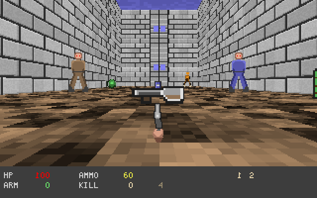
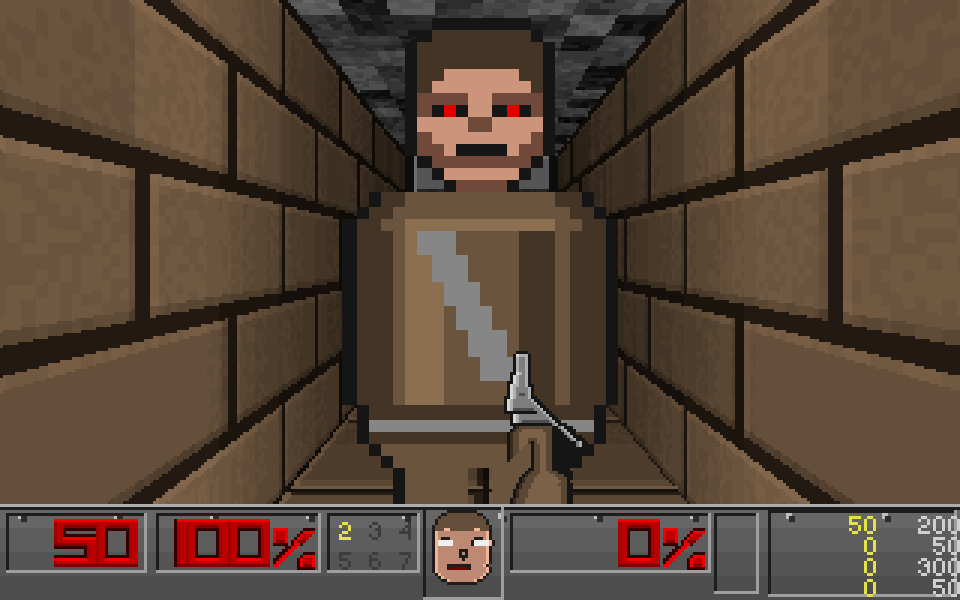
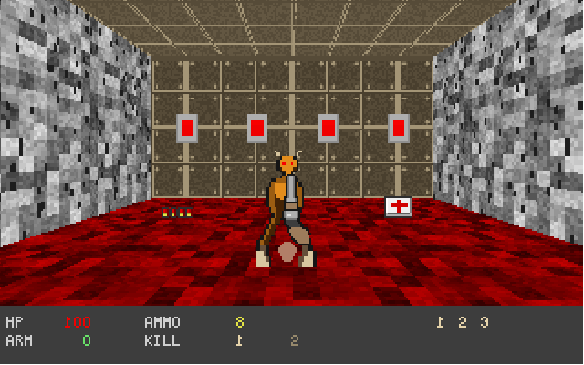
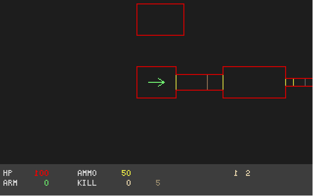
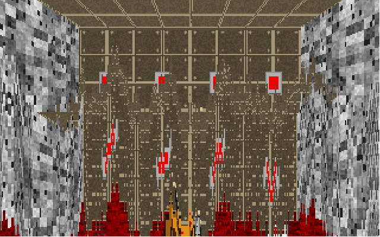
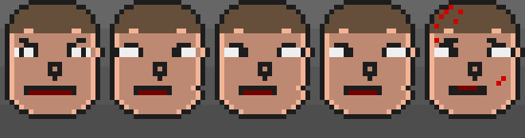

**English** | [Русский](README.ru.md)

# asm-doom — a DOOM parody written entirely in assembly

> ⚠️ **Work in progress.** It is playable, but plenty is still unfinished —
> there is an honest list at the end of this file. Breaking changes may land
> at any time.

A DOOM-style engine written **entirely in NASM x86-64**. Not a single line of
C, no linker, no runtime, and not one external asset file: `nasm -f bin`
emits a flat image, and the PE32+ header and import table are assembled by
hand. All the graphics — palette, colormaps, wall textures, flats, sky,
monster sprites, the weapon in your hands, the font and the status bar — are
either **generated by code at startup** or defined as pixel art directly in
the source.



---

## What this is, and what it is not

This is an **independent parody / homage**, not a port and not a re-release
of DOOM.

- The project is **in no way affiliated** with id Software, ZeniMax or
  Microsoft.
- It contains **no original DOOM assets whatsoever**: no WAD files, no
  sprites, no textures, no sounds, no maps. Everything is drawn and
  synthesised from scratch.
- What was taken from the original are its **rules**: physics constants,
  damage formulas, renderer architecture, monster behaviour. These are
  mechanics rewritten from a description, not copied code.
- The levels, monsters and weapons are original — recognisable only in
  spirit.

DOOM® is a trademark of id Software LLC. The name is used purely to explain
what this project resembles.

## How it was made

Every line of code, all the graphics and all the sound in this repository were
written by **Claude Opus 5 in extra mode** — through conversation, in
iterations, with every step verified by screenshots and automated playthrough
runs. No third-party code was used: no DOOM sources, no external libraries, no
ready-made sprites, no asset-store content. The only external dependencies are
the Windows system DLLs (`kernel32`, `user32`, `gdi32`, `winmm`).

---

## Screenshots

| | |
|---|---|
|  |  |
| Skill selection menu | Hall under the sky: shotgun on the floor, zombie and sergeant |
|  |  |
| A zombie up close, and the status bar | Level 3: the ledge reached by the stairs you built |
|  |  |
| Automap of level 2 | The screen "melt" between levels |



*The status bar portrait: the pupils track left / centre / right, and blood
appears as you take damage.*

---

## Building and running

All you need is [NASM](https://www.nasm.us/). No linker required.

```bash
powershell -File build.ps1
```

You get `doom.exe` (~180 KB). Just double-click it.

### Debug flags

| Flag | What it does |
|---|---|
| `-shot N` | run N tics, save the frame to `shot.bmp` and exit |
| `-walk` | auto-walk forward, pressing "use" periodically |
| `-fire` | fire continuously |
| `-map` | open the automap immediately with the full map revealed |
| `-lev N` | start on level N |
| `-skill N` | skill 1..5 |
| `-god` | invulnerability (the same `CF_GODMODE` as the original IDDQD) |
| `-wipe` | trigger the screen melt just before the screenshot |

The entire project was developed through these flags: the engine plays itself
hands-free and produces the screenshots that show what broke.

## Controls

| Key | Action |
|---|---|
| W / S / ↑ / ↓ | forward / back |
| A / D | strafe |
| ← / → | turn |
| Shift | run |
| Ctrl / LMB | fire |
| Space / E | use (doors, switches) |
| 1…7 | switch weapon |
| M | toggle mouse capture |
| Tab | automap |
| +/− | automap zoom |
| Esc | menu |

---

## What's inside

```
doom.asm            build entry point: module include order
src/pe64.inc        hand-written PE32+ header
src/imports.inc     import table for kernel32/user32/gdi32/winmm
src/i_main.asm      main loop, 35 tics/s timing, input, logging
src/i_video.asm     window, 320x200x8 DIB, StretchDIBits, screenshots
src/m_fixed.asm     16.16 fixed point, BAM angles, finesine/finetangent/tantoangle
src/v_pal.asm       palette + 34 colormaps
src/r_tex.asm       procedural wall textures, flats, sky
src/r_main.asm      view setup, portal traversal of sectors
src/r_seg.asm       wall rendering (equivalent of R_StoreWallRange)
src/r_plane.asm     visplanes: floors, ceilings, sky
src/r_things.asm    world sprites and the weapon in hand
src/r_draw.asm      column and span rasterisation
src/r_art.asm       pixel-art loader into DOOM's column format
src/p_setup.asm     level loading, blockmap, line lists
src/p_map.asm       P_CheckPosition / P_TryMove / P_PathTraverse
src/p_map2.asm      wall sliding, shooting, line of sight, explosions
src/p_mobj*.asm     objects, state machine, projectiles, respawn
src/p_enemy.asm     monster AI
src/p_inter.asm     damage, death, pickups
src/p_user.asm      player and the weapon in hand
src/p_spec.asm      doors, lifts, floors, switches, teleports
src/p_ceil.asm      ceilings, crushers, stairs, P_ChangeSector
src/f_wipe.asm      the screen melt between levels
src/am_map.asm      automap
src/m_menu.asm      skill selection menu
src/st_bar.asm      status bar and the face
src/s_sound.asm     mixer on top of waveOut
src/info.asm        object state and property tables
src/art*.inc        pixel art: monsters, weapons, items, effects, HUD
src/levels.inc      level data
```

### Renderer

The BSP is replaced by **portal traversal of sectors**: sectors are convex, so
their front-facing walls never overlap in X, and recursing through portals
yields the same front-to-back order that the original's BSP walk does.
Everything else is ported literally: `drawseg`s with silhouettes, visplanes
with `R_FindPlane`/`R_CheckPlane`, the `ceilingclip`/`floorclip` arrays,
diminishing light via `scalelight`/`zlight`, sky through `ANGLETOSKYSHIFT`.

### Mechanics

The constants come from the original: friction `0xE800`, `STOPSPEED 0x1000`,
`MAXMOVE 30`, 24-unit step-up, 24-unit drop-off, `forwardmove {0x19,0x32}`,
`sidemove {0x18,0x28}`, `angleturn {640,1280}`. Damage, armour absorption
(1/3 and 1/2), ammo limits, the backpack, the stats of all seven weapons,
monster pain chances and `BASETHRESHOLD` all match DOOM.

**Hitscan.** `P_BulletSlope` auto-aims along the view angle and, on a miss,
tries ±(1<<26) — the same ±5.6° as the original; the bullet travels along
`mo->angle` with `(P_Random()-P_Random())<<18` spread, pistol damage is
`5*(P_Random()%3+1)`, and the shotgun fires 7 pellets.

**Skill.** It works as in the original, not just as an ammo multiplier: map
things carry `MTF_EASY/NORMAL/HARD` bits, Nightmare uses the Ultra-Violence
set, the easiest skill halves incoming damage, `G_SetFastParms` speeds up
demons and projectiles, and corpses get back up after 12 seconds.

### Graphics

Textures are built from the rules that actually make things look "DOOM-ish":
every block is lit from the upper left — a bright bevel along the top and left
edges, shadow along the bottom and right, a dark seam between blocks; rivets at
the corners of panels; fine grain on top. Brick runs in rows offset by half a
block.

Sprites are defined character by character right in the source (`.` is
transparent, `1`..`8` are colours from that sprite's palette); the loader
converts them into DOOM's column format and distributes them across frames and
rotations. Objects that share a shape differ only by palette: the sergeant is
the same zombie in a blue uniform, the three keycards are one drawing, the four
spheres are one drawing.

### Sound

A custom subsystem on top of `waveOut`: 11025 Hz, 16-bit, stereo, 8 mixer
channels. Samples are synthesised by code at startup — noise bursts (weapons,
explosions), square tones, "growls" (a low tone plus noise with vibrato),
frequency sweeps (doors, teleport). Volume falls off with distance, and the
stereo pan comes from the angle to the source.

---

## Levels

1. Starting hall, a corridor with a manual door, a large hall under the sky
   with the exit switch.
2. A lift, a blue keycard, a locked door, a teleport. The exit hall is
   geometrically disconnected from the rest of the map — the teleport is the
   only way in.
3. A four-step staircase and a crusher above a nukage pit.

---

## Not done yet

An honest list as of now:

- **Sprites.** The pistol, the zombie and the imp have been properly redrawn.
  The shotgun, chaingun, rocket launcher, plasma gun, BFG, chainsaw, demon and
  baron are still on the older, noticeably cruder art.
- No dedicated attack or death frames for monsters: a shared corpse frame is
  used instead.
- No intermission screen between levels.
- Masked mid-textures on two-sided lines are not rendered.
- No music.
- No multiplayer, and none planned.

## License

MIT — see [LICENSE](LICENSE).

The license covers the code and artwork in this repository. It grants **no**
rights to DOOM, its assets, or id Software's trademarks.

---

<sub>Written entirely by Claude Opus 5 (extra mode). No third-party code or sprites were used.</sub>
