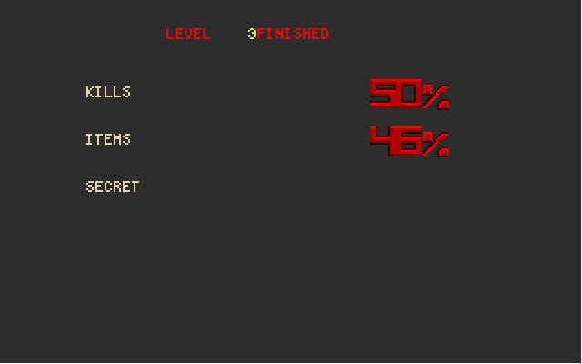
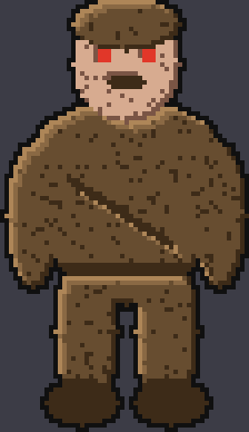
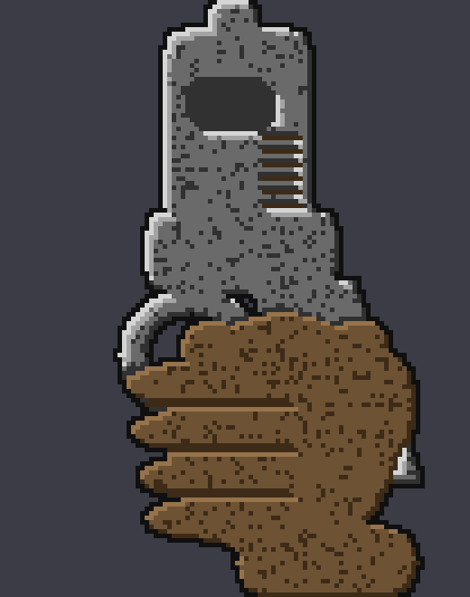

[English](README.md) | **Русский**

# asm-doom — пародия на DOOM целиком на ассемблере

> ⚠️ **Проект в разработке.** Играбельно, но многое ещё не доделано — честный
> список в конце файла. Ломающие изменения возможны в любой момент.

Движок в духе DOOM, написанный **целиком на NASM x86-64**. Ни строчки C,
ни линкера, ни рантайма, ни единого внешнего файла ресурсов: `nasm -f bin`
выдаёт плоский образ, а PE32+-заголовок и таблица импортов собраны вручную.
Вся графика — палитра, карты освещения, текстуры стен, полы, небо, спрайты
монстров, оружие в руках, шрифт и строка состояния — **генерируется кодом при
старте** или задана пиксель-артом прямо в исходнике.


---

## Что это и чем не является

Это **самостоятельная пародия-оммаж**, а не порт и не переиздание DOOM.

- Проект **никак не связан** с id Software, ZeniMax и Microsoft.
- В нём **нет ни одного оригинального ресурса DOOM**: ни WAD-файлов, ни
  спрайтов, ни текстур, ни звуков, ни карт. Всё нарисовано и синтезировано
  с нуля.
- Из оригинала взяты **правила игры**: константы физики, формулы урона,
  устройство рендерера, поведение монстров. Это переписанные по описанию
  механики, а не скопированный код.
- Уровни, монстры и оружие — свои, узнаваемые лишь по духу.

DOOM® — торговая марка id Software LLC. Название используется только для того,
чтобы объяснить, на что похож проект.

## Как это сделано

Весь код, вся графика и весь звук в этом репозитории написаны
**Claude Opus 5 в extra-режиме** — в диалоге, итерациями, с проверкой каждого
шага скриншотами и автопрогонами. Сторонний код не использовался: ни исходники
DOOM, ни чужие библиотеки, ни готовые спрайты, ни ассеты из ассет-сторов.
Единственные внешние зависимости — системные DLL Windows
(`kernel32`, `user32`, `gdi32`, `winmm`).

---

## Скриншоты

| | |
|---|---|
|  |  |
| Меню выбора сложности | Зал под небом: дробовик на полу, зомби и сержант |
|  |  |
| Зомби вплотную и строка состояния | Уровень 3: уступ, куда ведёт построенная лестница |
|  |  |
| Автокарта уровня 2 | «Расплавление» экрана при смене уровня |
|  |  |
| Экран статистики между уровнями | Спрайт зомби в пятикратном увеличении |



*Спрайт пистолета в семикратном увеличении: кисть в перчатке на рукояти,
четыре согнутых пальца, над кистью видна спусковая скоба.*


*Портрет в строке состояния: зрачки ездят влево/прямо/вправо, при ранении
появляется кровь.*

---

## Сборка и запуск

Нужен только [NASM](https://www.nasm.us/). Линкер не требуется.

```bash
powershell -File build.ps1
```

Получится `doom.exe` (~180 КБ). Запускается двойным кликом.

### Отладочные ключи

| Ключ | Что делает |
|---|---|
| `-shot N` | прогнать N тиков, сохранить кадр в `shot.bmp` и выйти |
| `-walk` | автоходьба вперёд с периодическим «использовать» |
| `-fire` | непрерывная стрельба |
| `-map` | сразу открыть автокарту с полной картой |
| `-lev N` | начать с уровня N |
| `-skill N` | сложность 1..5 |
| `-god` | неуязвимость (тот же `CF_GODMODE`, что и в оригинальном IDDQD) |
| `-wipe` | запустить «расплавление» экрана перед снимком |
| `-net [адрес]` | сетевая игра: без адреса ждёт, с адресом подключается |

Этими ключами велась вся разработка: движок гоняется без рук и сам делает
скриншоты, по которым видно, что сломалось.

## Мультиплеер

Двое по локальной сети напрямую, без сервера, без подбора игроков и без
настроек. Одна сторона ждёт, вторая подключается по адресу:

```
doom.exe -net              на первой машине -- ждёт
doom.exe -net 192.168.1.5  на второй, адрес первой
```

По сети не ходят координаты. Передаётся `ticcmd` -- шестнадцать байт с
движением, поворотом и кнопками за тик. Симуляция детерминированная, поэтому
из одинаковых команд обе машины получают одинаковый мир; ровно так был
устроен сетевой код оригинала. Тик не считается, пока не пришли команды на
него от всех, иначе миры разъедутся. UDP теряет пакеты, а потерянная команда
-- это разошедшиеся миры, поэтому в каждом пакете едет не одна команда, а
последние четыре.

В строке состояния ячейки оружия сменяются счётом фрагов: убил соперника --
плюс, подорвался сам или попал под монстра -- минус. Павший поднимается на
точке старта, карта при этом не перезагружается.

## Управление

| Клавиша | Действие |
|---|---|
| W / S / ↑ / ↓ | вперёд / назад |
| A / D | стрейф |
| ← / → | поворот |
| Shift | бег |
| Ctrl / ЛКМ | огонь |
| Space / E | использовать (двери, переключатели) |
| 1…7 | смена оружия |
| M | захват мыши вкл/выкл |
| Tab | автокарта |
| +/− | масштаб автокарты |
| Esc | меню |

---

## Что внутри

```
doom.asm            точка сборки: порядок включения модулей
src/pe64.inc        PE32+ заголовок вручную
src/imports.inc     таблица импортов kernel32/user32/gdi32/winmm
src/i_main.asm      главный цикл, тайминг 35 тиков/с, ввод, лог
src/i_video.asm     окно, DIB 320x200x8, StretchDIBits, снимок экрана
src/m_fixed.asm     арифметика 16.16, углы BAM, finesine/finetangent/tantoangle
src/v_pal.asm       палитра + 34 карты освещения (COLORMAP)
src/r_tex.asm       процедурные текстуры стен, флэты, небо
src/r_main.asm      настройка вида, портальный обход секторов
src/r_seg.asm       отрисовка стен (аналог R_StoreWallRange)
src/r_plane.asm     визплейны: полы, потолки, небо
src/r_things.asm    спрайты мира и оружие в руках
src/r_draw.asm      растеризация столбцов и полос
src/r_art.asm       загрузчик пиксель-арта в формат колонок DOOM
src/p_setup.asm     загрузка уровня, blockmap, списки линий
src/p_map.asm       P_CheckPosition / P_TryMove / P_PathTraverse
src/p_map2.asm      скольжение вдоль стен, стрельба, видимость, взрывы
src/p_mobj*.asm     объекты, машина состояний, снаряды, респавн
src/p_enemy.asm     ИИ монстров
src/p_inter.asm     урон, смерть, подбор предметов
src/p_user.asm      игрок и оружие в руках
src/p_spec.asm      двери, лифты, полы, переключатели, телепорты
src/p_ceil.asm      потолки, давящие потолки, лестницы, P_ChangeSector
src/f_wipe.asm      «расплавление» экрана при смене уровня
src/am_map.asm      автокарта
src/m_menu.asm      меню выбора сложности
src/st_bar.asm      строка состояния и мордочка
src/wi_stuff.asm    экран статистики между уровнями
src/s_sound.asm     микшер поверх waveOut
src/s_music.asm     музыка на два голоса прямо в микшере
src/info.asm        таблицы состояний и параметров объектов
src/art*.inc        пиксель-арт: монстры, оружие, предметы, эффекты, HUD
src/levels.inc      данные уровней
```

### Рендерер

BSP заменён **портальным обходом секторов**: секторы выпуклые, поэтому их
лицевые стены не перекрывают друг друга по X, и рекурсия по порталам даёт тот
же порядок «спереди назад», что и обход BSP в оригинале. Всё остальное
перенесено буквально: `drawseg`'и с силуэтами, визплейны с
`R_FindPlane`/`R_CheckPlane`, массивы `ceilingclip`/`floorclip`, затемнение по
`scalelight`/`zlight`, небо через `ANGLETOSKYSHIFT`.

### Механика

Константы взяты из оригинала: трение `0xE800`, `STOPSPEED 0x1000`,
`MAXMOVE 30`, шаг вверх 24 единицы, обрыв 24, скорости `forwardmove {0x19,0x32}`,
`sidemove {0x18,0x28}`, `angleturn {640,1280}`. Урон, поглощение бронёй (1/3 и
1/2), лимиты патронов, рюкзак, характеристики семи стволов, вероятности боли
монстров, `BASETHRESHOLD` — как в DOOM.

**Хитскан.** `P_BulletSlope` берёт наклон автонаведением по углу взгляда, при
промахе пробует ±(1<<26) — те же ±5.6°, что в оригинале; пуля летит по
`mo->angle` с разбросом `(P_Random()-P_Random())<<18`, урон пистолета
`5*(P_Random()%3+1)`, дробовик даёт 7 дробин.

**Сложность.** Работает как в оригинале, а не только на боезапас: объекты
карты несут биты `MTF_EASY/NORMAL/HARD`, «кошмар» берёт набор ультра-насилия,
на лёгкой игрок получает половину урона, `G_SetFastParms` ускоряет демонов и
снаряды, а трупы поднимаются через 12 секунд.

### Графика

Текстуры построены по правилам, которые и делают вид «думовским»: каждый блок
освещён сверху-слева — светлая фаска по верхней и левой кромке, тень по нижней
и правой, тёмный шов между блоками; заклёпки по углам полей; мелкое зерно
поверх. Кирпич идёт рядами со сдвигом на полблока.

Спрайты задаются посимвольно прямо в исходнике (`.` — прозрачно, `1`..`8` —
цвета из палитры спрайта), загрузчик переносит их в формат колонок DOOM и
раскладывает по кадрам и ракурсам. Одинаковые по форме объекты отличаются
только палитрой: сержант — тот же зомби в синей форме, три ключа — один
рисунок, четыре сферы — один рисунок.

### Звук

Своя подсистема поверх `waveOut`: 11025 Гц, 16 бит, стерео, 8 каналов микшера.
Сэмплы синтезируются кодом при старте — шумовые всплески (оружие, взрывы),
квадратные тоны, «рычание» (низкий тон + шум с вибрато), частотные свипы
(двери, телепорт). Громкость падает с расстоянием, панорама берётся из угла на
источник.

---

## Уровни

1. Стартовый зал, коридор с дверью по нажатию, большой зал под небом, за ним
   двор, разрезанный кислотным каналом, и ниша выхода на уступе за каналом.
2. Лифт, синий ключ, дверь под ключ, телепорт. Зал выхода геометрически не
   связан с остальной картой — попасть туда можно только телепортом.
3. Лестница из четырёх ступеней и давящий потолок над кислотной нишей, из
   ниши проход в верхний зал под небом.
4. Хаб под небом с тремя крыльями: север к синему ключу, восток через
   запертую дверь к выходу, юг в скрытый арсенал.

---

## Что ещё не сделано

Честный список на текущий момент:

- Последовательность смерти -- пять кадров, оседанию не хватает веса.
- Спрайты собираются из эллипсов с расчётной светотенью: объём есть, но
  ручной проработки деталей нет.
- У какодемона и потерянной души заимствованы только кадры смерти.
- Не рисуются полупрозрачные средние текстуры двусторонних линий.
- В сетевой игре двое; больше игроков потребует раздачи команд по кругу.
- Игроки на карте выглядят одинаково: перекраски по номеру игрока нет.

## Лицензия

MIT — см. [LICENSE](LICENSE).

Лицензия распространяется на код и графику этого репозитория. Она **не даёт**
никаких прав на DOOM, его ресурсы или торговые марки id Software.

---

<sub>Написано полностью Claude Opus 5 (extra mode). Стороннего кода и спрайтов не использовалось.</sub>
